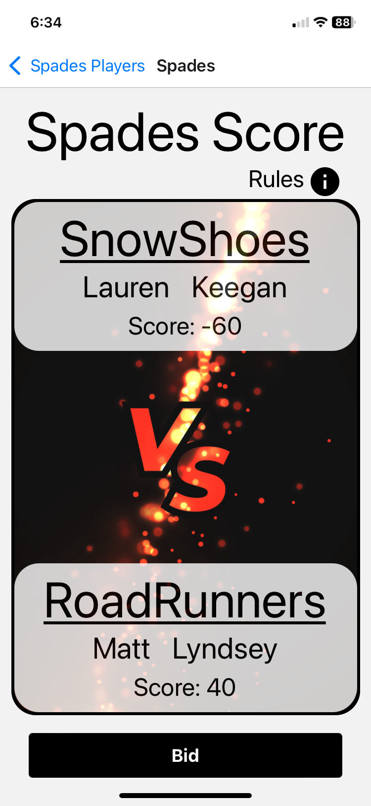

<!-- Add pictures -->

# Score Titan

## Description

Whether you're sitting down to play card games and then have to find pencil and paper to keep score or looking for new ideas Score Titan can help. This mobile application allows you to keep score on your phone. Built using React Native as a front-end framework and storing data with useState and Async Storage.

## Table of Contents

- [Installation](#installation)
- [Usage](#usage)
- [License](#license)
- [Contributing](#contributing)
- [Future Features](#future-features)

## Installation

Fork repository and follow the links below for development mode using Expo Go. Will need to download the ExpoGo app on your mobile device as well. When running the project on your laptop can see and update changes using the ExpoGo app on your phone. 
Note: your laptop and phone will need to be on the same wifi to work. Currently only Spades Games is built out. Work on one of the other games or create your own!

- ExpoGo Website: https://docs.expo.dev/get-started/expo-go/
- React-Native Expo Setup: https://reactnative.dev/docs/environment-setup?guide=quickstart&platform=ios

I was unable to build the app to put on my phone since I have windows OS on my laptop and iOS for my mobile device but there is lots of documentation on creating an app if your cirumstances are different.

|                      Home Screen                       |                   Create Teams                    |                         Bids                          |
| :----------------------------------------------------: | :-----------------------------------------------: | :---------------------------------------------------: |
|  |  |  |

|                   Spades Scoring Page                   |                      Winner Screen                       |
| :-----------------------------------------------------: | :------------------------------------------------------: |
|  |  |

## Usage

Choose a game option from the main menu. Follow the prompts for creating players and/or teams. If you need help click on the rules button to see how to play or score the game. Keep score of the game as you play and when there is a winner the app will automatically change to a winner screen to let you know who won.

## License

MIT License

## Contributing

The following websites were used for reference to create this application: 

- https://reactnative.dev/docs/environment-setup?guide=quickstart&platform=ios
- https://www.youtube.com/watch?v=wVNPmxntwKQ

## Future Features

- Connect front-end framework to a database so you can see score history and keep track of your overall wins and losses
- Demo pop-up for how to play the game

## Attributions

Background Image for Spades Game:
<a href="https://www.freepik.com/free-vector/battle-versus-vs-banner-product-comparison-background-with-sparkles_17819860.htm#query=vs%20png&position=41&from_view=search&track=ais&uuid=cfb7194c-50d6-44fe-94ee-8b0487326c81">Image by starline</a> on Freepik
